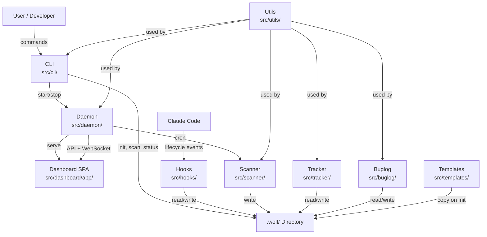

<!-- generated-by: gsd-doc-writer -->

# Architecture

OpenWolf is a token-conscious AI brain for Claude Code projects. It operates as a Node.js CLI tool that installs itself into a project's `.wolf/` directory and provides filesystem scanning, session tracking, a local dashboard, and Claude Code hooks to reduce token waste and preserve context across sessions.

## System Overview

OpenWolf has three independently compiled artifacts that together form a working CLI:

1. **CLI + Core** (`tsc` via `tsconfig.json`) — compiles `bin/` and `src/` (excluding `src/dashboard/app`) to `dist/`. Entry point: `dist/bin/openwolf.js` (generated by `pnpm build`; `dist/` is a build output directory that does not exist until after the build completes).
2. **Hooks** (`tsc -p tsconfig.hooks.json`) — compiles `src/hooks/*.ts` into standalone Node scripts that Claude Code executes directly. Hooks run in isolation and cannot import from `src/utils/` at runtime; `src/hooks/shared.ts` is a thin barrel that re-exports utilities from six internal `wolf-*` modules.
3. **Dashboard** (Vite, `src/dashboard/app`) — a React 19 + TailwindCSS 4 SPA built to `dist/dashboard/`. Served by the Express daemon (`src/daemon/wolf-daemon.ts`).

The CLI is the user-facing interface. The daemon runs in the background, serving the dashboard and running scheduled cron tasks. Hooks integrate with Claude Code's lifecycle events (session start, pre-read, post-read, pre-write, post-write, stop). The scanner maintains an `anatomy.md` file that maps every tracked file to a description and token estimate, which the hooks consult to surface file descriptions and warn about repeated reads, reducing token waste.

## Component Diagram



## Data Flow

A typical OpenWolf interaction flows as follows:

1. **Initialization** (`openwolf init`): The CLI copies templates from `src/templates/` into the project's `.wolf/` directory, copies pre-compiled hooks, writes Claude Code settings and rules, and performs an initial filesystem scan.
2. **Scanning**: `src/scanner/anatomy-scanner.ts` walks the project tree, skipping excluded paths and binary files. For each file, it extracts a description and estimates token count, writing the results to `.wolf/anatomy.md`.
3. **Session Start**: When Claude Code starts a session, the `session-start` hook creates a fresh `_session.json`, detects worktree mode, cleans up stale `.tmp` files, appends a session header to `memory.md`, and checks cerebrum and buglog freshness.
4. **Pre-Read**: Before Claude Code reads a file, the `pre-read` hook checks `anatomy.md`. If the file is already described there, the hook prints the description to stderr as a hint to Claude Code. If the file was already read earlier in the same session, it warns about the repeated read, prompting the developer to reuse existing knowledge.
5. **Pre-Write**: Before Claude Code writes a file, the `pre-write` hook checks the `cerebrum.md` Do-Not-Repeat section for patterns that should be avoided. It also searches `buglog.json` for similar past bugs when the edit looks like a fix.
6. **Post-Read**: After Claude Code reads a file, the `post-read` hook updates the token estimate in the session file for that file.
7. **Post-Write**: After Claude Code writes a file, the `post-write` hook updates `anatomy.md` with a fresh description and token count, appends a structured entry to `memory.md`, tracks edit counts in the session file, and auto-detects bug-fix patterns to log to `buglog.json`.
8. **Session Stop**: The `stop` hook finalizes the session, checks for files edited multiple times without a corresponding buglog entry, verifies cerebrum and STATUS.md freshness, and writes session totals to `token-ledger.json`.
9. **Dashboard**: The user opens `openwolf dashboard`, which launches a browser connected to the local Express daemon. The dashboard fetches project state, health metrics, and file data via authenticated HTTP and WebSocket APIs.

## Key Abstractions

| Name | Type | Description | Location |
|------|------|-------------|----------|
| `createProgram` | Function | Builds the Commander CLI with all subcommands | `src/cli/index.ts` |
| `CronEngine` | Class | Schedules and executes cron tasks, handles retries and dead-letter queue | `src/daemon/cron-engine.ts` |
| `WolfClient` | Class | Dashboard WebSocket client for real-time updates | `src/dashboard/app/lib/wolf-client.ts` |
| `scanProject` | Function | Walks the project tree and writes `anatomy.md` | `src/scanner/anatomy-scanner.ts` |
| `buildAnatomy` | Function | Builds anatomy content and file count without writing to disk | `src/scanner/anatomy-scanner.ts` |
| `finalizeSession` | Function | Finalizes session state, performs checks, and writes totals to `token-ledger.json` | `src/hooks/stop.ts` |
| `logBug` | Function | Appends a structured bug entry to `.wolf/buglog.json` | `src/buglog/bug-tracker.ts` |
| `safeCompareToken` | Function | Constant-time token comparison for daemon auth | `src/daemon/wolf-daemon.ts` |
| `ensureWolfDir` | Function | Verifies the `.wolf/` directory exists; exits silently if missing | `src/hooks/shared.ts` |
| `readJSON` / `writeJSON` | Functions | Safe filesystem helpers with defaults | `src/utils/fs-safe.ts` |
| `Logger` | Class | File-based logger with level filtering | `src/utils/logger.ts` |

## Directory Structure Rationale

The project is organized into three top-level build targets and supporting directories:

```
openwolf/
├── bin/                    # CLI entry point (Node.js shebang, version gate)
├── src/
│   ├── cli/                # Commander subcommands (init, scan, status, dashboard,
│   │                       #   daemon, cron, bug, update, restore, designqc)
│   ├── daemon/             # Express HTTP server + WebSocket + cron engine + file watcher
│   ├── dashboard/app/      # React 19 SPA (components, hooks, lib, styles)
│   ├── designqc/           # Screenshot capture engine for design quality checks
│   ├── hooks/              # Claude Code lifecycle hooks (6 hooks + shared utilities)
│   ├── scanner/            # Filesystem scanner and description extractors
│   ├── templates/          # Canonical `.wolf/` files copied on init
│   ├── tracker/            # Token estimation and ledger accounting
│   ├── buglog/             # Bug log read/write helpers
│   └── utils/              # Shared utilities (paths, fs-safe, logger, platform, worktree)
├── docs/                   # VitePress documentation site
├── tests/                  # Test structure (cli/, hooks/, utils/, security.test.ts)
├── dist/                   # Build output (CLI + core, hooks, dashboard, templates)
└── .wolf/                  # Runtime project directory (created by init in consumer projects)
```

- **`bin/`**: Contains the single entry point script that imports the compiled CLI from `dist/`. It includes a Node.js version gate (requires Node 20+).
- **`src/cli/`**: Each subcommand lives in its own file. Commands are registered in `index.ts` and loaded on demand to keep startup fast.
- **`src/daemon/`**: The daemon is a long-running Express server. It serves the dashboard static files, exposes authenticated REST and WebSocket APIs, and embeds the cron engine and file watcher.
- **`src/dashboard/app/`**: A modern React SPA built with Vite. It uses a custom hook (`useWolfData`) for API communication and TailwindCSS for styling.
- **`src/hooks/`**: The lifecycle hook scripts are standalone Node scripts executed by Claude Code; they are not imported by the CLI or daemon at runtime. `shared.ts` and the wolf-* modules are imported by the scanner during the core build. `shared.ts` is a thin barrel that re-exports utilities from six internal `wolf-*` modules (`wolf-paths`, `wolf-files`, `wolf-json`, `wolf-anatomy`, `wolf-describe`, `wolf-misc`).
- **`src/scanner/`**: `anatomy-scanner.ts` is the main scanner. `description-extractor.ts` and the `extractors/` subdirectory handle language-specific description extraction for TypeScript, JavaScript, Go, PHP, SQL, and other file types.
- **`src/templates/`**: The source of truth for every file that `openwolf init` copies into a project's `.wolf/` directory. Editing these changes what new projects receive.
- **`src/tracker/`**: `token-estimator.ts` calculates token counts. `token-ledger.ts` manages the session ledger. `waste-detector.ts` identifies token waste patterns.
- **`src/buglog/`**: Simple structured JSON read/write for the bug log, with similarity search.
- **`src/utils/`**: Cross-cutting utilities used by CLI, daemon, and scanner. Hooks do not import from here at runtime; they use `src/hooks/shared.ts` instead.
- **`tests/`**: Root-level test directory with `cli/`, `hooks/`, and `utils/` subdirectories plus a top-level `security.test.ts` for security integration tests.
